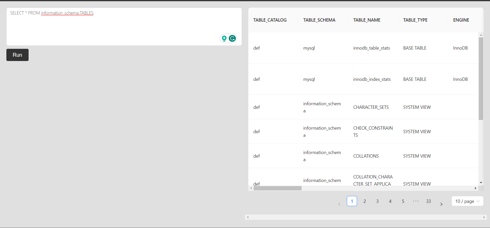
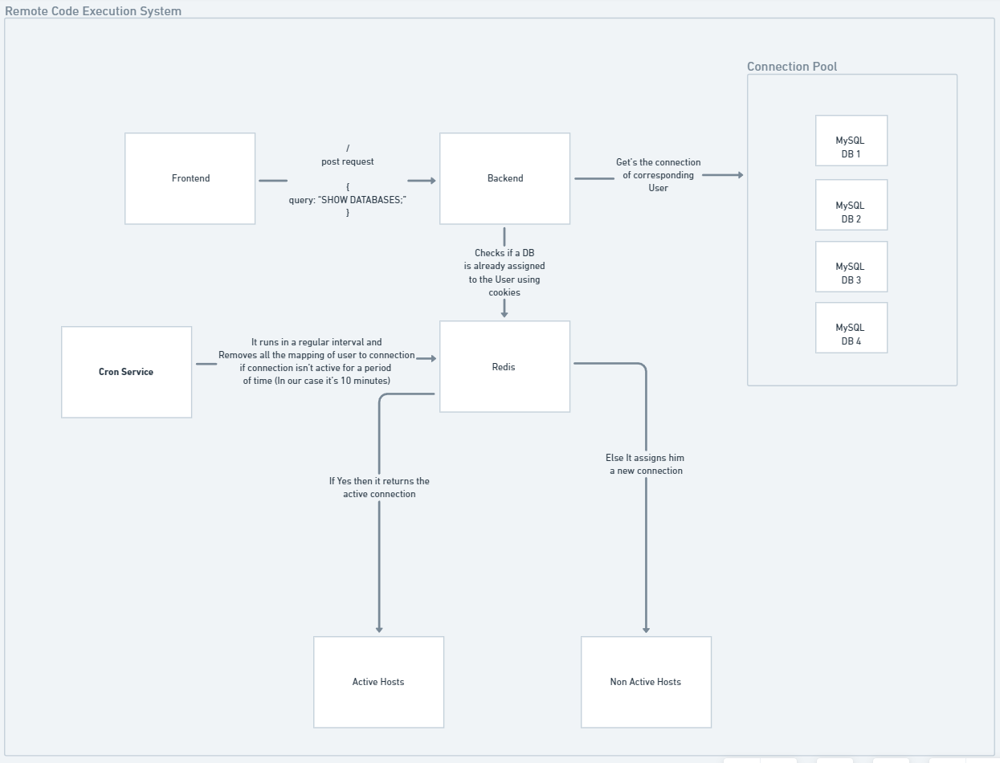
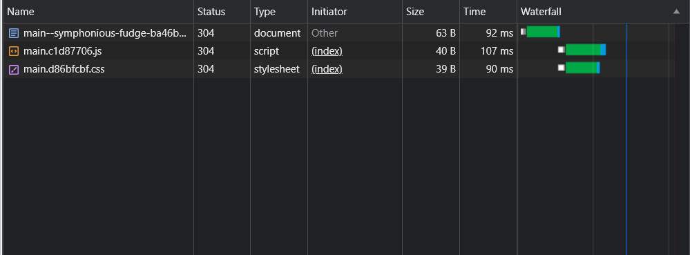

# SQL Remote Code Execution Engine

Welcome to the SQL Remote Code Execution Web Application repository! This project is a powerful yet user-friendly web-based application designed to streamline the process of executing SQL queries and visualizing their results. It can be used by a developer, a data analyst, or a database administrator, our application provides an intuitive interface for interacting with databases and retrieving valuable insights from your data.


## Youtube Video Url
Please visit the url [Video URL](https://youtu.be/PzU25yj1k44) for complete understanding regarding the solution approach. Feel free to connect for any query.

## Hosted Link
 - [Hosted Link](https://main--symphonious-fudge-ba46bd.netlify.app/) Please note that the Application is hosted on free available shared servers. You might face downtime issues on the hosted link. You can run the system locally on Docker container for not facing such issues.


## Features

Frontend is built using React and Ant Design, offering a clean and intuitive interface for users to input their SQL queries. The interface accepts the input from the user and runs the sql query against that input. The result then shows up in a table 



The backend, constructed with Node.js, is augmented by Redis to efficiently manage user sessions. Redis ensures individual user isolation by assigning distinct databases to each user. Inactivity is addressed through a scheduler that automatically disengages user databases after a 10-minute period, freeing up resources for new users. Currently, the system accommodates up to 4 concurrent users. Moreover, the system's architecture is readily scalable horizontally, enabling seamless expansion to handle higher loads. The diagram below provides a comprehensive visualization of the system's design:



Below is the loadtime of the application. Since it's a not so UI intensive but if it was we can make the UI loads in less amount of time using Code Spliting/ Lazy Loading in react. I've saperated the codes in different components for the current scenario so to make application more performant.




## Authors

- [@kartikpapney](https://github.com/kartikpapney)


## Tech Stack

**Client:** React, Ant Design

**Server:** Node, Express

**npm packages:** body-parser, cookie-parser, cors, cron, dotenv, jsonwebtoken, mysql2, redis, http

**Database:** MySQL, Redis

**Tools:** Docker

**Cloud** Render (Backend), Railway (MySQL, Redis), Netlify (Frontend) Github


## Clone Project

Clone the project

```bash
  git clone https://github.com/kartikpapney/RCE
```

Go to the project directory

```bash
  cd RCE
```


## Installation

The project can run locally on docker container. Make sure you have Docker properly installed on your system.

```bash
  1. Create a file .env in the root directory and copy the data from sample.env to .env file 
  2. docker compose build
  3. docker compose up
```